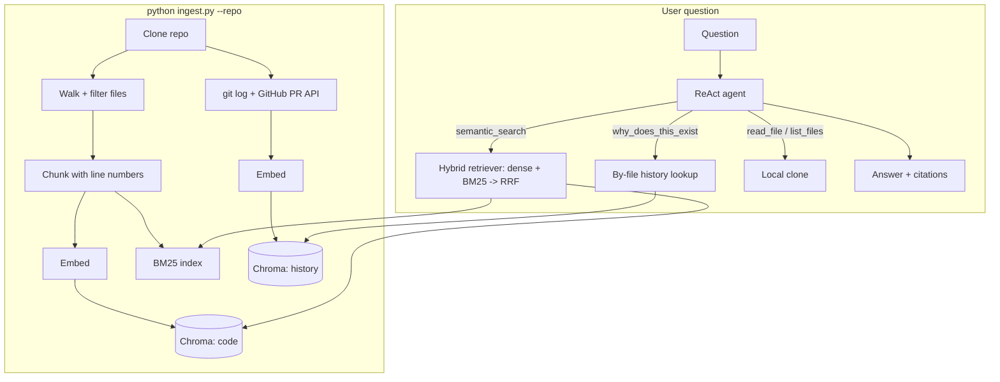

# स्मृति Smriti

A RAG agent that answers questions about a codebase by retrieving from both the **code** and the **git history that shaped it**.

## The problem

A developer joining an unfamiliar repository spends days reconstructing context. Existing codebase chatbots index source files and answer *what* the code does. They can't answer *why* it is the way it is — that knowledge lives in commit messages, PR descriptions, and linked issues, none of which get indexed.

Two failure modes in particular:

- **Intent questions fail.** "Why is there a retry loop here?" — the answer is in a bug-fix commit from eight months ago, not in the source.
- **Symbol lookup fails.** "Where is `validateUserToken` defined?" — dense embeddings return chunks *about* token validation, not the chunk *containing* the definition.

Smriti indexes both the code and the git/PR history behind it, fuses dense and sparse retrieval, and cites every claim it makes.

## Architecture



Two indexes, two inks in the UI: code retrieval is blue, history retrieval is ochre — so an answer's strata bar shows at a glance whether it came from source or from the story behind it.

## Results

The project's engineering thesis: **multi-index retrieval (code + history) with hybrid dense/BM25 search measurably beats single-index dense retrieval.** Measured on a 110-item eval set mined from `fastapi/fastapi`'s merged PRs (PR body → query, files it touched → ground truth), retrieval only, no agent:

| config | recall@5 | MRR |
|---|---|---|
| dense | 0.167 | 0.158 |
| bm25 | 0.142 | 0.149 |
| hybrid | 0.139 | 0.152 |
| **hybrid + history** | **0.411** | **0.358** |

`hybrid + history` more than doubles dense-only recall (2.46x) — searching git/PR history for similar past work and folding matched files into the ranking is the single biggest lever in the system. The leakage risk this invites (an eval query *is* a PR body that might itself be sitting in the history index) was checked, not assumed: every eval item's own PR record is excluded from its own history search, verified with a concrete before/after case, not just present in the code.

**Plain `hybrid` doesn't beat `dense`** on this eval set, and that's reported as-is rather than glossed over. Eval queries are full PR descriptions, averaging 114 words — a different regime from the short, keyword-dense symbol lookups ("where is `_get_flat_body_params` defined?") where BM25 is decisive (verified separately: dense misses that query's target in the top 3, hybrid finds it at #1). BM25 alone underperforms dense on long natural-language queries, and naive equal-weight RRF fusion of a weaker ranking into a stronger one can drag the combined result down. `bm25`'s strength is exact-identifier lookup, which a PR-description eval set doesn't exercise.

Full numbers: [`eval/results/`](eval/results/). Rebuild the eval set and re-run yourself with `python -m eval.build_eval_set --repo <url>` then `python evaluate.py --config all`.

## Setup

Requires Python 3.11+ (built and tested on 3.12), an OpenAI API key, and a GitHub token (public read access is enough — avoids the 60 req/hr unauthenticated rate limit).

```bash
git clone <this-repo-url> smriti
cd smriti
python3 -m venv .venv
source .venv/bin/activate
pip install -r requirements.txt
cp .env.example .env   # fill in OPENAI_API_KEY and GITHUB_TOKEN
```

Index a repo, then chat with it:

```bash
python ingest.py --repo https://github.com/fastapi/fastapi
python app.py
# open http://localhost:8000
```

`ingest.py` clones the repo, chunks and embeds the code, builds a BM25 index, and mines git/PR history — all idempotent, safe to re-run. Embeddings are cached by content hash, so re-indexing an unchanged repo costs nothing.

## Cost and timing

Measured on `fastapi/fastapi` (1,147 source files → 7,206 chunks, English docs only — see [Limitations](#limitations)):

- Indexing: ~2.5 minutes end to end (clone, chunk, embed, BM25, git/PR history)
- API cost: **$0.0997** total (one-time; cached on re-runs)
- Answer latency: ~12s for a typical multi-tool-call question (target was under 15s)
- Eval set build: ~6 min (mining ~800 PRs) · full 4-config evaluation: ~4 min

## Limitations

Reported honestly rather than left implicit:

- **English docs only.** `file_walker` indexes just `docs/en/` when a canonical-language docs root exists (fastapi ships 13 translations; English was ~9% of its markdown files, and near-duplicate translated embeddings were crowding real source code out of retrieval results for short queries). Repos without that convention are indexed in full. A real, deliberate tradeoff: 5 of 110 eval items reference a non-English doc as ground truth and can no longer be recalled by design.
- **Plain hybrid retrieval underperforms dense-only** on long, prose-heavy queries (see [Results](#results)) — not a bug, a property of naive equal-weight RRF fusing a weaker ranking into a stronger one.
- **Public repos only**, no auth, no multi-user state, single machine.
- **No AST-aware chunking.** Splitting is language-aware (via `langchain-text-splitters`) but not syntax-tree-based, so a chunk boundary can occasionally land mid-construct.
- **No code graph.** The agent can't answer "who calls this function" — only lexical/semantic retrieval and file navigation.
- **Single-turn conversation.** Each question is independent; the agent doesn't carry context across turns.
- **Occasional LLM transcription slips in prose.** Structured citations (`citations[]`, built directly from what a tool actually retrieved) are exact by construction, but the free-text answer occasionally mis-states a number while restating something the citation already has correct — verified with a real case (a citation correctly said `routing.py:2255-2280`; the prose answer once said "line 1255"). Trust the citation chip, not the number in the sentence, until this project extends structured citations further into the answer text itself.

## Future work

- Repo map: LLM-generated file/directory summaries as a third retrieval layer
- Query routing: classify query type, route to the appropriate index
- Multi-turn conversation memory
- AST-aware chunking via tree-sitter
- Code graph tools (`find_callers`, `get_dependencies`)
- Incremental re-indexing on new commits
- Private repo support
- VS Code extension

## Project structure

```
config.py                every tunable lives here
ingest.py                CLI: clone, chunk, embed, index
app.py                   FastAPI server (/, /info, /chat)
evaluate.py               CLI: run retrieval-only evaluation
src/
  ingestion/              clone, walk, chunk, git/PR history mining
  indexing/               embedding cache, Chroma, BM25
  retrieval/              hybrid retriever (dense + BM25 -> RRF)
  agent/                  ReAct agent, tools, system prompt
  utils/                  logger, citations
eval/                     eval set builder, metrics, results
frontend/                 chat UI (vanilla HTML/CSS/JS, no build step)
tests/
```

## Stack

FastAPI · LangChain (`create_agent`) · ChromaDB · `rank_bm25` · OpenAI (`gpt-4o-mini`, `text-embedding-3-small`) · GitPython · PyGithub

## Demo

*(manual follow-up: record a ~60s GIF showing three questions — a lookup, e.g. "where is the APIRouter class defined?"; a conceptual one, e.g. "how does dependency injection work?"; and a "why" question, e.g. "why is there a separate dependencies module?")*
