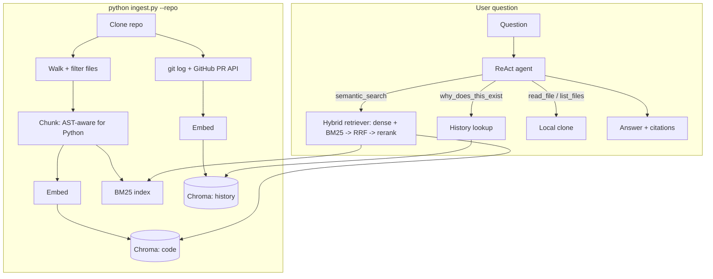

# स्मृति Smriti

A RAG agent that answers questions about a codebase using both the **code** and the **git/PR history behind it** — so it can answer not just *what* the code does, but *why*.

## Architecture



Query optimization (LLM rewrite before retrieval) and LLM reranking sit in front of the hybrid retriever. Code citations render blue, history citations ochre.

## Results

110-item eval set mined from `fastapi/fastapi`'s merged PRs, retrieval only:

| config | recall@5 | MRR |
|---|---|---|
| dense | 0.171 | 0.160 |
| hybrid | 0.145 | 0.154 |
| hybrid + history | 0.456 | 0.393 |
| + query optimizer | 0.576 | 0.474 |
| **+ reranker** | **0.595** | **0.472** |

Full stack recovers the right file in the top 5 on ~60% of queries — **3.5x dense-only**. Biggest single levers: folding in git/PR history (2.7x dense) and AST-aware chunking (0.476 → 0.595 on top of the rest). Full numbers and methodology: [`eval/results/`](eval/results/).

## Setup

Requires Python 3.11+, an OpenAI API key, and a GitHub token (public read access — avoids the 60 req/hr unauthenticated limit).

```bash
git clone <this-repo-url> smriti && cd smriti
python3 -m venv .venv && source .venv/bin/activate
pip install -r requirements.txt
cp .env.example .env   # fill in OPENAI_API_KEY and GITHUB_TOKEN

python ingest.py --repo https://github.com/<owner>/<repo>
python app.py
# open http://localhost:8000
```

Works on any public GitHub repo. Embeddings are cached by content hash, so re-indexing an unchanged repo costs nothing. Indexing `fastapi/fastapi` (~1,150 files) takes ~2.5 min and costs ~$0.10 in API calls, one-time.

## Limitations

- **Public repos only** — no private-repo auth, single machine, single user
- **English docs only** — non-English doc translations are skipped when a `docs/en/` convention exists, to keep near-duplicate translations from crowding out source code in retrieval
- **AST-aware chunking is Python-only** — other languages use a character-based splitter
- **Single-turn** — no conversation memory across questions
- **No code graph** — can't answer "who calls this function," only lexical/semantic search + file navigation

## Future work

Repo map summaries · query routing · multi-turn memory · AST chunking for more languages · code graph tools (`find_callers`) · incremental re-indexing · private repo support

## Project structure

```
config.py          every tunable lives here
ingest.py           CLI: clone, chunk, embed, index
app.py               FastAPI server (/, /info, /chat)
evaluate.py           CLI: retrieval-only evaluation
src/
  ingestion/          clone, walk, chunk, git/PR history mining
  indexing/            embedding cache, Chroma, BM25
  retrieval/            hybrid retriever, query optimizer, reranker
  agent/                 ReAct agent, tools, system prompt
  utils/                  logger, citations
eval/                eval set builder, metrics, results
frontend/            chat UI (vanilla HTML/CSS/JS)
tests/
```

## Stack

FastAPI · LangChain (`create_agent`) · ChromaDB · `rank_bm25` · `tree-sitter` · OpenAI (`gpt-4o-mini`, `text-embedding-3-small`) · GitPython · PyGithub
